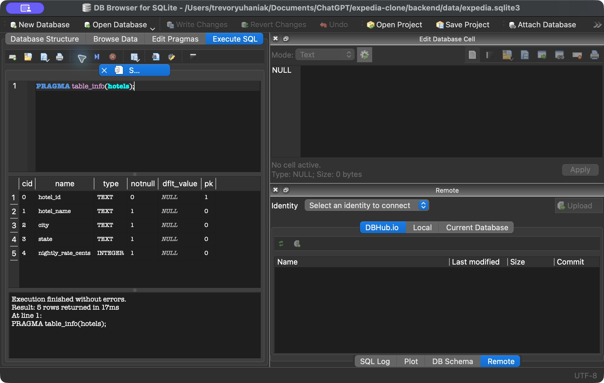
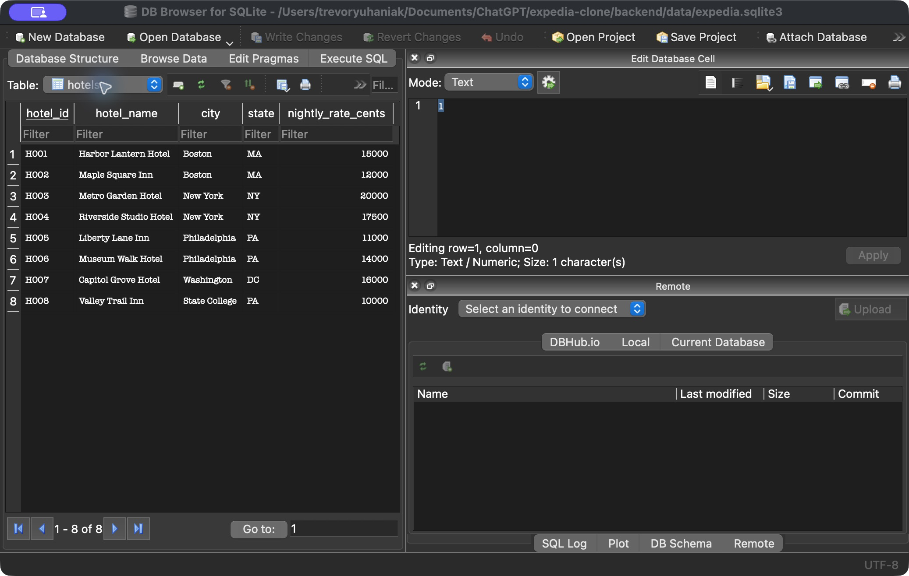
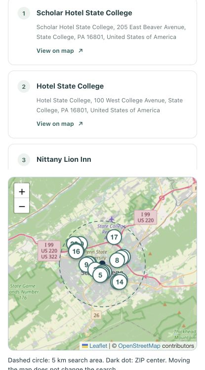

# Assignment 2 Part 2 database and API inspection

Historical inspection before local-storage migrations. Its missing-field
observations describe the original database, not current schema v5. See
[the current report](../report.md) for implemented Part 2 behavior.

Inspection on October 1, 2026, on branch `assignment2_part2_in_class`. The existing
database stores fictional hotel names and sample prices, but lacks provider-place
identity, street addresses, coordinates, and inventory by hotel and date. The live
discovery response contains location information only; it supplies no nightly rate.

## Database evidence

Opened in DB Browser for SQLite:
`/Users/trevoryuhaniak/Documents/ChatGPT/expedia-clone/backend/data/expedia.sqlite3`.
This is the path configured by this project's backend and README. The instructor's
`backend/db/expedia.sqlite3` is a different path; no database was moved or recreated.

Inspected Database Structure, Browse Data → `hotels`, and executed the read-only
query `PRAGMA table_info(hotels);`. The existing Python environment
`backend/.venv/bin/python` also captured schema and hotel rows using SQLite
`mode=ro`. [Full database inspection](evidence/assignment2-part2/database-inspection.json).

| Column | Definition |
| --- | --- |
| `hotel_id` | `TEXT PRIMARY KEY`; existing IDs `H001`–`H008` |
| `hotel_name` | `TEXT NOT NULL` |
| `city` | `TEXT NOT NULL` |
| `state` | `TEXT NOT NULL` |
| `nightly_rate_cents` | `INTEGER NOT NULL CHECK(nightly_rate_cents >= 0)` |

SQLite's `table_info` reports `notnull=0` for this declared TEXT primary key;
the remaining columns report `notnull=1`. There are eight hotel rows. Examples:

| ID | Hotel name | City | State | Sample nightly rate in cents |
| --- | --- | --- | --- | --- |
| H001 | Harbor Lantern Hotel | Boston | MA | 15000 |
| H002 | Maple Square Inn | Boston | MA | 12000 |
| H003 | Metro Garden Hotel | New York | NY | 20000 |
| H008 | Valley Trail Inn | State College | PA | 10000 |





## Live search evidence

Submitted ZIP `16802` in the Part 1 application at `http://127.0.0.1:5173/`.
Expected: a verified U.S. ZIP center and hotels within 5 km. Observed: State
College, 20 hotel cards and map markers, and the result-limit notice.

The browser Network-panel step remains **unverified**: computer-use access to
Chrome was not approved, and native control of the Codex app was unavailable.
Instead, one additional GET to the same frontend-proxied endpoint captured a real
HTTP 200 response:
`http://127.0.0.1:5173/api/discovery/hotels?postcode=16802`.
This is a separate request, not an export of the original browser transaction.
There were two live discovery submissions for this inspection, normally four
Geoapify requests in total. No quota-failure tests were performed.

[Full captured JSON response](evidence/assignment2-part2/api-response.json).
Only the response body was saved; no cookies, request headers, or API keys were
captured. This is the app's normalized response, not the raw Geoapify payload.

The response reports `provider: "geoapify"`, ZIP `16802`, country `us`, center
`40.803167822, -77.861384958`, `radius_meters: 5000`, `result_limit: 20`,
`limit_reached: true`, and `omitted_count: 0`. All 20 hotel objects have exactly
these five field names. The first object is:

```json
{
  "place_id": "51268f029ffa7653c05961f07a7ab6654440f00103f9018ef41f2f0200000092031b5363686f6c617220486f74656c20537461746520436f6c6c656765",
  "name": "Scholar Hotel State College",
  "address": "Scholar Hotel State College, 205 East Beaver Avenue, State College, PA 16801, United States of America",
  "latitude": 40.7946313,
  "longitude": -77.8590467
}
```



## Field comparison

| API information | Actual response field | Matching database column or missing |
| --- | --- | --- |
| Provider hotel ID | `hotels[].place_id` | Missing provider-ID storage or mapping. `hotel_id` is the existing local fictional identifier, not a saved Geoapify ID. |
| Hotel name | `hotels[].name` | `hotels.hotel_name` is the conceptual match; current rows are fictional, not imported API hotels. API names can be missing, while the database requires a name. |
| Address | `hotels[].address` | Missing. `city` and `state` do not store the full formatted address. |
| Latitude | `hotels[].latitude` | Missing. |
| Longitude | `hotels[].longitude` | Missing. |
| Nightly rate | No field in the captured response | `hotels.nightly_rate_cents` exists only for fictional sample rates; the API supplies no price to map into it. |

The observed $100 sample rate for H008 does not establish a price for Scholar
Hotel State College or any other API hotel. The response also has no stay dates,
currency, room counts, or availability. Unknown prices must remain unknown until
a separately defined source or explicitly labeled simulation supplies them.

## Date specific storage

All six tables were inspected through their saved SQL definitions:

| Table | Relevant storage and limitation |
| --- | --- |
| `hotels` | Local hotel ID and one sample base rate; no date or available-room count. |
| `trips` | References `hotels.hotel_id`, with `check_in` and `check_out`; no per-night rate or room inventory. |
| `bookings` | References a trip and user, stores status and accepted `total_cents`; a booking total is not nightly inventory. |
| `users` | Account information; no hotel inventory. Credential values were not inspected or captured. |
| `sessions` | Session-to-user relationship; no hotel inventory. Session values were not inspected or captured. |
| `search_history` | User query, search time/day and repetition count; the search date is not a stay date. |

There is no table combining a hotel reference, a stay date, that night's rate,
and available-room count. There is no unique hotel/date relationship or foreign
key for such inventory. Schema version is 2; `PRAGMA foreign_key_check` returned
no violations.

## Requirements for the next schema prompt

These are proposed requirements based on the inspection, not implemented changes:

- Preserve existing fictional hotel IDs, trips, accounts, bookings and accepted
  totals. Migrate the existing database without reseeding.
- Define separate external-place storage with provider identity and place ID,
  a uniqueness rule for that pair, name, address, latitude and longitude.
  Preserve honest missing values and attribution. Do not silently replace the
  fictional hotel records or attach their prices to external hotels.
- Define the intended hotel relationship for a dated inventory table. Each record
  needs a hotel foreign key, stay date, nightly rate and rooms available, with one
  record per hotel/date and validation for dates and nonnegative amounts/counts.
  Define currency and how inventory is obtained before displaying prices.
- Establish an authorized rate and availability source, or explicitly label any
  classroom simulation. The captured discovery API provides neither.

The schema, database contents and application code were left unchanged. The
database file hash was checked before and after inspection. Evidence uses only
public hotel-place information, fictional hotel rows and schema definitions.
No environment or dependency changes were needed.

To complete the remaining manual checkpoint, open browser DevTools → Network,
filter Fetch/XHR, submit a ZIP, select `hotels?postcode=16802`, then inspect
Response. Capture only the public response body; omit headers and cookies.
