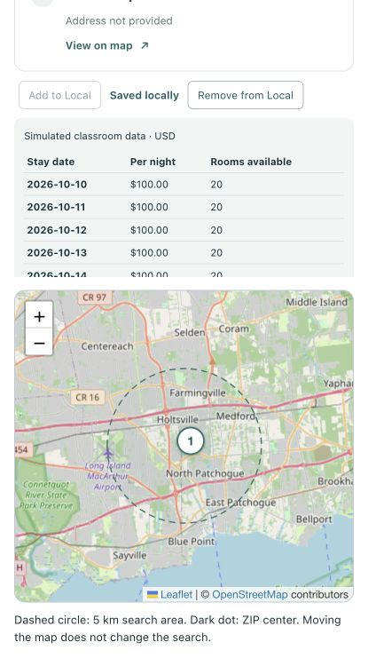

# Assignment 2 Part 2 local hotel workflow

Historical local-storage foundation checkpoint (schema v4). The current app
retains this workflow and uses schema v5, which adds conversations and traces.
See [RAG verification](rag-context.md) for current suite totals and final scope.

Completed October 1, 2026. Add/Remove actions now persist API hotels and searched
ZIP associations. Search uses local results when available and calls the original
Part 1 endpoint only after a successful empty local response. SQLite remains the
source of saved status and daily demo values.

## Storage and API behavior

Database: `/Users/trevoryuhaniak/Documents/ChatGPT/expedia-clone/backend/data/expedia.sqlite3`.
Schema version 4 adds `saved_search_locations` (ZIP, U.S. country, locality and
coordinates) and `saved_hotel_zips` (composite hotel/ZIP key and foreign keys).
The first saved location for a ZIP is retained. A hotel's address is not used to
infer its searched ZIP: nearby hotels can have a different postal address ZIP.

The new Model operations use parameterized SQL and transactions. Controllers
validate the 5 km hotel/context relationship and supply the fixed classroom dates.
New request schemas reject invalid coordinates, blank IDs, invalid ZIP/country
values and unexpected price fields; provider IDs are preserved exactly. The server
accepts the valid search context submitted by the app without making an additional
geocoding request during save. This classroom collection is shared locally and is
separate from account-owned Assignment 1 bookings.

`POST /api/local-hotels` receives `hotel` and `center`, inserts only missing rows,
and creates October 10–14, 2026 demo nights inclusive. It returns the saved hotel
and its current nightly rows only after commit. Repeated saves cannot duplicate a
hotel, hotel/ZIP pair or hotel/date pair, and do not overwrite modified rates or
available-room counts. Defaults of $100.00/night and 20 rooms are fictional values,
not Geoapify data.

`GET /api/local-hotels?postcode=...` returns stored context and hotel/night records
in one database snapshot. `POST /api/local-hotels/status` resolves saved state by
provider ID, including records associated with a different ZIP. Local lookup,
status and mutation responses are not cached. The existing Part 1 discovery route,
response model and provider logic are unchanged.

`DELETE /api/local-hotels?hotel_id=...` removes the hotel's nightly rows, all ZIP
associations and hotel together. It removes an associated ZIP context only if no
other hotel uses that context. Repeated deletion is an idempotent success. Failed
transactions roll back and return safe errors. Other hotels and all Assignment 1
records remain untouched.

## Interface behavior

- Search first requests local matches. A successful nonempty response shows
  **Saved locally**, the stored ZIP center, dated rates and room counts, and a
  notice that this saved subset is not a complete hotel inventory.
- A successful empty response uses the frozen Part 1 search, labels **API results**,
  then checks provider IDs against the database. A local/status failure displays
  an error, not an assumed unsaved state or a provider fallback.
- Add/Remove are sibling controls outside the card's selection button. Add is
  disabled for saved hotels and pending saves; removal is offered only for saved
  hotels. Both wait for backend success before changing saved status or results.
- Removal from a local result updates list and map membership. After removing the
  last local hotel, the app prompts for a new search rather than silently calling
  the provider. API-result cards remain available to add again after removal.
- The search form is disabled during mutations, duplicate actions are blocked,
  requests time out, and late responses cannot change another search's state.
  Feedback names the hotel. No browser storage is used as persistent saved state.

## Verification evidence

All mutation tests used temporary databases; provider calls were mocked. No real
Geoapify discovery requests were made during this workflow verification. Normal
OpenStreetMap imagery was used by the browser map.

| Check | Expected | Observed |
| --- | --- | --- |
| Backend regression | Existing and new behavior passes | 180 passed; one existing Starlette deprecation warning |
| Frontend regression | Local-first ordering, statuses, errors, pending actions and selection pass | 39 passed |
| Lint and build | Clean frontend checks | Oxlint, ESLint and production build passed |
| Migration | Fresh/v1/v2/v3 databases reach v4; repeated startup preserves records | Passed using temporary databases |
| Repeated and concurrent save | One hotel, one association, five nights; edited values retained | Passed, including eight concurrent saves |
| Multiple ZIPs and removal | Global provider identity; delete all of its associations and nights only | Passed; unrelated hotel retained |
| Failed save/delete | No partial writes or orphan records | Trigger-injected failures rolled back; safe 503 responses |
| Part 1 behavior | Same response contract; search itself creates no saved rows | Regression passed |
| Browser API fallback | Empty local result precedes API result and status lookup | Mock ZIP 00501 displayed two API hotels with Add controls |
| Browser save | Saved status only after successful write; selection unaffected | Add disabled, Remove appeared, card/marker selection retained |
| Refresh and restart | Saved status, context and rates come from SQLite | Both test services restarted using the same database; saved results returned, including an edited $123.45/7-room night |
| Browser removal failure | Keep saved record and controls until success | Simulated failure displayed an error and retained the hotel |
| Browser removal success | Remove only that saved result and marker | First hotel disappeared; second hotel, its five nights and marker remained |
| Browser local failure | Error with no provider request | Simulated missing association table produced 503; server log showed no discovery fallback; retry recovered |
| Keyboard | Enter on a card and Space on a marker synchronize selection | Passed with separate Add/Remove controls |
| Mobile | Controls and dated table fit without page overflow | Verified at 415 px width |
| Normal database preservation | No mutation-test records or changes to existing records | All original eight tables, indexes and rows matched a private pre-change backup; new association count remained zero |



Browser fixture database: `/tmp/expedia-part2-workflow-browser.sqlite3`.
Test servers used ports 8001/5174 and were stopped after verification. Normal
services were restarted on 8000/5173 after confirming their commands and working
directories belonged to this project. Unrelated processes were not stopped.

## Manual checkpoint

Open `http://127.0.0.1:5173/`, search a ZIP, add one API hotel, then search the same
ZIP again. Confirm Saved locally, five dated demo nights and the simulated-data
label. Refresh and repeat the search; saved status should remain. Remove the
hotel and confirm it, its ZIP associations and nightly rows disappear together.
Inspect these tables in DB Browser:

```sql
SELECT * FROM saved_hotels;
SELECT * FROM saved_search_locations;
SELECT * FROM saved_hotel_zips;
SELECT * FROM demo_hotel_nights ORDER BY hotel_id, stay_date;
PRAGMA user_version;
PRAGMA foreign_key_check;
```

Expected schema version at this checkpoint: 4; current RAG version: 5.
Expected foreign-key check: no rows. The normal local
collection was left empty for the user's verification. No dependencies or
credentials were added to Git, and no commit or push was performed for this step.
