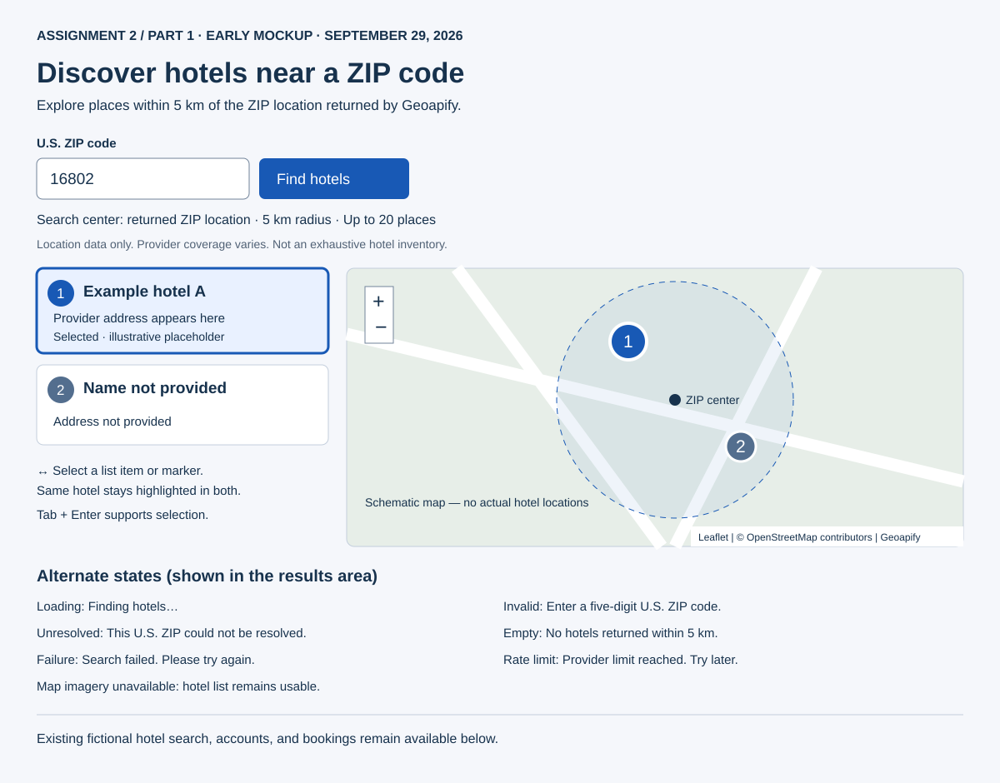

# Hotel Finder — research and early design

Prepared September 29, 2026, before implementing hotel discovery. Research is
based on the official product help and technical documentation linked below;
this is not a claim that every commercial interface was tested interactively.

## Interaction research

| Source | Useful pattern | Limitation for this project | Decision |
| --- | --- | --- | --- |
| [Google Hotels help](https://support.google.com/travel/answer/6276008?hl=en) | A list alongside a map supports exploring location and comparing places. | Prices, reviews, room details, and booking partners require information our Places response does not establish. | Use coordinated list/map selection; omit pricing, ratings, availability, and booking controls for live places. |
| [Google Maps nearby search](https://support.google.com/maps/answer/4610185?co=GENIE.Platform%3DDesktop&hl=en) | Search around a chosen location and select a pin to identify a place. | Relevance-based ordering does not itself communicate a strict search boundary. | Show the resolved ZIP center and a 5 km circle. Label the search center explicitly and do not use device geolocation or map movement to trigger new searches. |

## API/library research and resulting decisions

- [Geoapify geocoding](https://apidocs.geoapify.com/docs/geocoding/): reuse our
  structured postcode lookup with U.S. filtering and verify the returned ZIP,
  country, result type, and numeric coordinates before requesting places.
- [Geoapify Places](https://apidocs.geoapify.com/docs/places/): request
  `accommodation.hotel`, `filter=circle:lon,lat,5000`, proximity ordering, and
  `limit=20`. Retain provider place IDs, names, display addresses, and coordinates.
  One page only; coverage varies and the app does not claim an exhaustive inventory.
- [Leaflet reference](https://leafletjs.com/reference.html) and
  [download page](https://leafletjs.com/download.html): use stable 1.9.4, keyboard
  accessible numbered markers, a radius circle, and a single selected provider ID.
  Pass untrusted names into DOM text, never popup HTML. Remove map listeners and
  the map on unmount. List buttons work without requiring a mouse.
- [OpenStreetMap tile policy](https://operations.osmfoundation.org/policies/tiles/):
  use the standard HTTPS tile endpoint with visible OSM attribution, browser
  caching and normal referrer behavior. No prefetch, offline download, background
  tile crawler, or tile proxy. This is a modest local classroom demo; availability
  is not guaranteed. Tile errors must leave the hotel list usable.
- [Geoapify pricing](https://www.geoapify.com/pricing/) and
  [terms](https://www.geoapify.com/terms-and-conditions/): retain Geoapify and OSM
  attribution. The September 29 research recorded a free-plan allowance of 3,000 credits/day
  and up to 5 requests/second; current account limits remain provider-controlled. Use an explicit submit action with duplicate submission
  prevention, no automatic retry/pagination, and mocked failures for routine tests.
  A successful search uses one geocoding request and one Places request (20-result
  page); no paid subscription is needed or activated.

## Early mockup

Created at 2026-09-29T15:20Z before application implementation. The illustration
contains explicitly labeled fictional placeholders, not live search evidence.
The layout stacks on narrow screens. Numbered list items and map markers share
one selection. Center/radius text and source attribution stay visible. The
early layout placed the fictional booking flow below discovery; the final app
uses a separate `/?demo=booking` page.

States: initial guidance; searching; results; invalid five-digit input; unresolved
U.S. ZIP; successful search with no nearby results; failed provider request;
rate limit; map imagery unavailable with a usable list. Editing the ZIP clears
stale results and selection. Selecting/panning the map does not spend API calls.

## Dependency approval

Checked `frontend/package.json`, the installed npm tree, and existing Python
imports. Leaflet was absent; HTTPX and dotenv were already available. The student
explicitly approved `npm install --save-exact leaflet@1.9.4` on September 29 in
this task. No other installation or upgrade is authorized by that approval.

## Implementation changes from the mockup

The final interface retains the ZIP form, numbered selection and feedback states.
It adds selected-hotel coordinates, an expandable center-location detail, omission
and limit notices, and separate map-imagery failure feedback.

A user-supplied travel-site reference informed the simpler header and white search
card. The final name is **Hotel Finder**, with a teal hotel icon and the headline
“Find somewhere to stay.” The generic hotel illustration contains no lettering.
Unsupported date, traveler-count, flight, promotion and booking controls were
omitted. The original booking UI is available separately at `/?demo=booking`.

Browser checks corrected map initialization order and explicit Enter-key selection.
The early mockup is preserved; intermediate screenshots are not needed to explain
these revisions. See [verification](assignment2-verification.md) and the
[final homepage](screenshots/assignment2-final-home.png).
