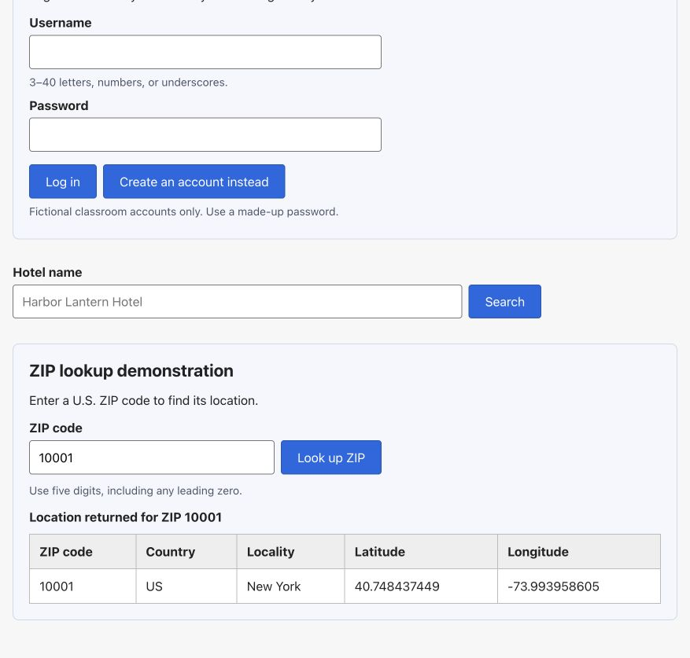

# ZIP lookup — verification evidence

Verified September 24, 2026.

## Observed behavior

The travel application's ZIP input sends the entered ZIP code to the FastAPI
backend. The backend requests Geoapify data and returns a verified U.S. location.
The interface displays the ZIP code, country, locality, latitude, and longitude
in a table. I reused the existing Geoapify key, which stays in the backend.

**Health-check configuration status: "key is configured".**

The attached screenshot shows ZIP **10001** entered in the form and the live
returned table: **New York, US**, latitude **40.748437449**, longitude
**-73.993958605**. ZIP **16802** was also verified directly through the backend
URL and through the Vue form, returning **State College, US**, latitude
**40.803167822**, longitude **-77.861384958**.

## Screenshots

Additional observed ZIP:
[ZIP 16802 input and returned table](screenshots/zip-input-16802.jpg).

Both screenshots were visually inspected. Neither contains an API key or
`.env` contents.

## Verification record

| Check | Implemented and verified evidence |
| --- | --- |
| Key and project structure | Existing key reused; configuration/controller remain under `backend/app/`, Vue source under `frontend/src/`. |
| Environment integration | Existing `backend/app/config.py` loads project-root `.env` through an explicit helper-relative path. |
| Health check | `GET /api/health` returned `status: ok` and `geoapify: key is configured`. |
| Direct backend ZIP test | `GET /api/demo/zip-location` returned HTTP 200 and real Geoapify data for 16802. |
| Frontend 16802 milestone | Previously verified fixed button; the final input form also successfully submitted 16802. The fixed backend route remains available. |
| Real ZIP input | Changing the input from 16802 to 10001 produced a different live location. Leading-zero ZIP strings and invalid input are covered by mocked tests. |
| Returned data table | Screenshot shows the entered ZIP and matching returned row, with labeled country, locality, latitude, and longitude. |

Validation: 97 backend tests, 23 frontend tests, both frontend linters, and the
production build passed. Browser checks confirmed loading/disabled controls,
invalid-input feedback, old-result clearing, and the existing hotel-name search
(two Harbor Lantern stays). No maps, shortlist, ZIP-based hotel retrieval,
dependencies, or frontend keys were added.

Live checks during this extension used three provider requests: one direct
backend 16802 request, one Vue 16802 request, and one Vue 10001 request. Automated
tests used mocks. Real provider outages were not induced; error mappings were
tested with mocks. The existing third-party TestClient deprecation warning remains.
