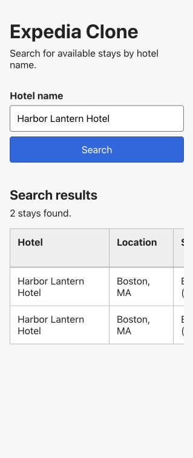
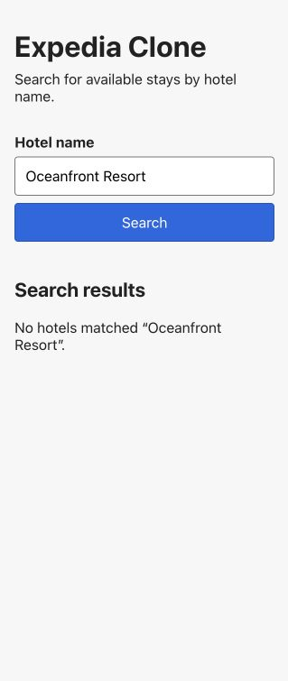

# Expedia Clone — Part 1

## Repository and commit

Repository URL: <https://github.com/tmy5235/Expedia-Clone>

Exact Part 1 commit: **Pending student review and accepted commit.**

## Implementation

The Vue frontend provides a labeled hotel-name input, Search button, plain results table, and clear loading, error, and no-results messages. It sends search requests through the Vite `/api` proxy.

FastAPI validates the request and returns JSON from `GET /api/stays`. The Python backend reads `hotels.csv` and `trips.csv`, matches hotel names without case sensitivity, joins the records using `hotel_id`, and calculates the number of nights and total stay price.

## Verification

| Action | Expected result | Observed result |
| --- | --- | --- |
| Search for `Harbor Lantern Hotel` in the browser | Display the hotel’s available stays from the supplied CSV files | Passed: displayed `T001` and `T009` with the expected dates, $150 nightly rates, and $300 totals |
| Search for `Oceanfront Resort` in the browser | Display a clear no-results message | Passed: displayed `No hotels matched “Oceanfront Resort”.` |
| Run backend tests | All hotel-search and API tests pass | Passed: 9 tests; one third-party FastAPI TestClient deprecation warning |
| Run frontend tests, Oxlint, ESLint, and production build | All checks pass | Passed: 4 tests, both linters, and the Vite build |
| Manually review changed files in VS Code | Student confirms the implementation is understood and accepted | Passed: student confirmed the files looked good on September 11, 2026 |

Successful search:

No-results search:

## Project context and next steps

Project context: [README](README.md), [AGENTS](AGENTS.md), [design note](docs/design.md), [selected prompts](prompts/README.md), and [current handoff](handoffs/current.md). Replace these relative links with links to the submitted GitHub commit before uploading the report.

Remaining work for Part 1 is the accepted Git commit, GitHub push, and replacement of the pending commit and relative links above with links to the submitted revision. Part 2 SQLite CRUD is outside the current scope.
